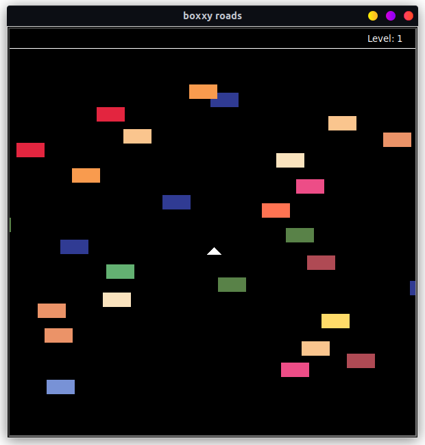
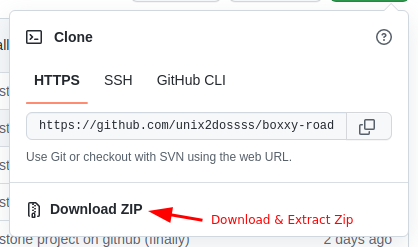

# Boxxy Roads

<p align="center">
  
</p>

## Project Overview

I have been completing the 100-Days-of-Python Course (references) and this was a project on Day 23 of the course. I took upon the challenge and wrote all the code myselef without using any sort of help. The course had a bare-bones version of the game, I implemented my own animations and graphics/colours to make it slightly more visually attractive.

* Optimized Random Obstactle Generation
* Collision Detection
* Spawning Animation
* Level Tracking

## Basic Instructions (Modes)

The objective of the game, is to not get hit by any obstacles and to reach the finish line. Each time you reach the end of the road, the level increases as well as the speed of the obstacles, and you respawn at the starting position.

## Download and Play

1. Make sure your system has Python installed. Install Python at [python.org](https://www.python.org/downloads/). Check if you have Python installed by typing the command ```python``` and pressing enter in your command prompt or terminal. If a prompt like ```>>>``` shows up, then Python is installed.
<br>

2. You can check if Git is installed on your system by typing ``git`` in the terminial; if no errors are returned, it is installed. If git is installed you can simply copy & paste the commands below to play the game ... (if Git is not installed, **Skip to Step 3**)

    ```bash
    git clone https://github.com/unix2dossss/boxxy-roads.git
    cd boxxy-roads
    python3 main.py
    ```
    - if ``python3`` returns an error, try ``python``.
<br>

3. If Git is not installed on your system, you can simply download and extract the zip.

<p align="center">
  
</p>

    cd boxxy-roads
    python3 main.py

## References

1. [Turtle](https://docs.python.org/3/library/turtle.html) (Graphics Library) powers the game graphics and mechanics.
<br>

2. [Time](https://docs.python.org/3/library/time.html) (Module) regulates generation intervals of obstacles.
<br>

3. [100 Days Of Code (Day 23)](https://www.udemy.com/course/100-days-of-code/)

## Bugs or Issues

If you find a bug or have an issue with Boxxy Roads, feel free to [Submit an Issue](https://github.com/unix2dossss/boxxy-roads/issues/new)